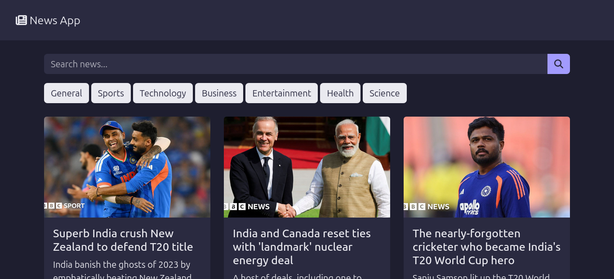
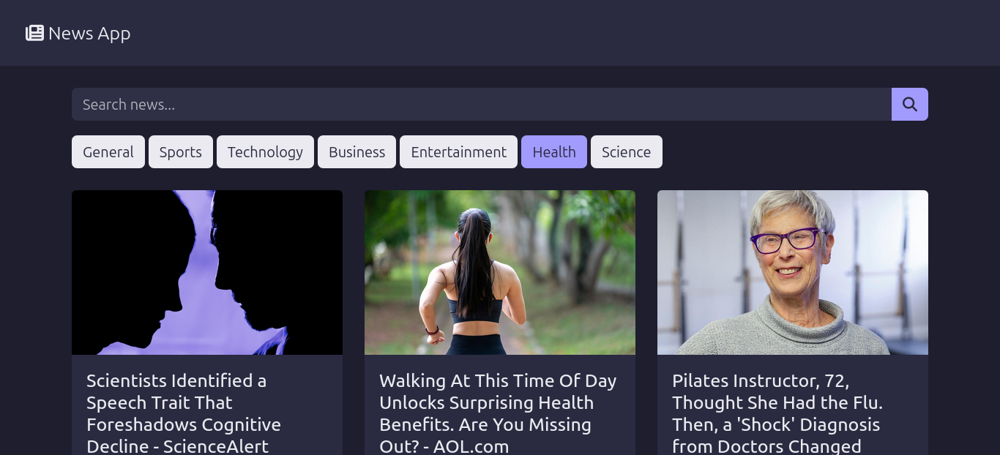

# 📰 News App (JavaScript + NewsAPI)

A modern **News Web Application** built using **HTML, CSS, Bootstrap 5.3, and JavaScript (ES6)** that fetches real-time news using the NewsAPI.

## 🚀 Features

* 🔍 Search news by keyword
* 🗂️ Category filters (Sports, Technology, Business, etc.)
*  ⚡ Fast performance with **caching**
* 🧠 Debounced search (prevents API spam)
* ⚠️ Proper error handling
* ⚡  ES6 array methods (filter, slice, forEach)
* 🎨 Pastel dark theme UI
* 📱 Mobile-first responsive design
* ⭐ Font Awesome icons
* 🚫 No inline JavaScript (clean structure)


## 🛠️ Tech Stack

* HTML5
* CSS3 (Custom + Bootstrap 5.3)
* JavaScript (ES6+)
* NewsAPI (REST API)


## 🔑 Getting Started

### 1. Clone the repository

```bash
git clone https://github.com/your-username/news-app.git
cd news-app
```

### 2. Get API Key

* Go to https://newsapi.org/
* Sign up and generate your API key

### 3. Add API Key

Open `app.js` and replace:

```js
const API_KEY = "YOUR_API_KEY";
```


## ▶️ Run the Project

Simply open `index.html` in your browser
OR use Live Server in VS Code


## 🌐 API Endpoints Used

### 🔍 Search News

```
https://newsapi.org/v2/everything?q=KEYWORD
```

### 🗂️ Category News

```
https://newsapi.org/v2/top-headlines?category=CATEGORY
```

Supported categories:

* business
* entertainment
* general
* health
* science
* sports
* technology


## ⚠️ Limitations

* API key is exposed (frontend-only project)
* Free NewsAPI plan has request limits
* Some categories may return limited results


## 🔐 Security Note

For production apps, use a **backend server** to hide API keys securely.


## 📸 Screenshots






